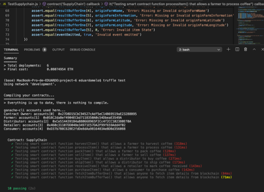

# Supply chain & data auditing

This repository containts an Ethereum DApp that demonstrates a Supply Chain flow between a Seller and Buyer. The user story is similar to any commonly used supply chain process. A Seller can add items to the inventory system stored in the blockchain. A Buyer can purchase such items from the inventory system. Additionally a Seller can mark an item as Shipped, and similarly a Buyer can mark an item as Received.

The DApp User Interface when running should look like...

## Transaction ID:

https://rinkeby.etherscan.io/tx/0xb9d483541bc9700d8f56f3b7243ee413961771a982dbdc71ee11dde697a7ba51

## Contract Address ID:

https://rinkeby.etherscan.io/address/0xfad8180469e06ac70963073a51b75702bf72bc3d

## Test smart contract tests all required functions.

## Program version numbers

node version: v10.16.3

Truffle version: Truffle v5.1.67 (core: 5.1.67)

Web3 version: v1.2.9

Sodlity: Solidity v0.5.16
